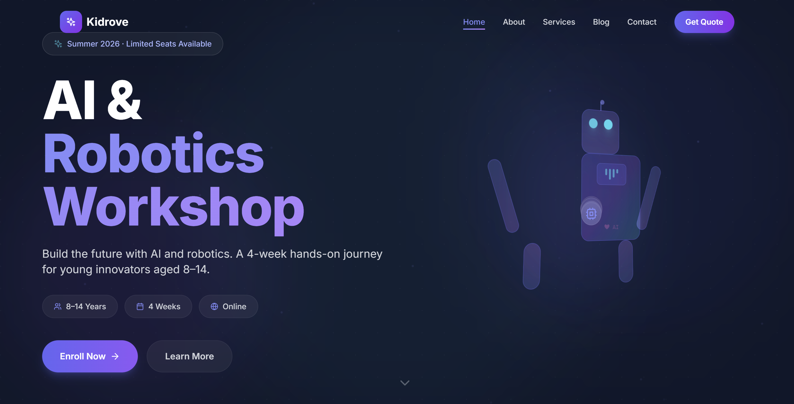
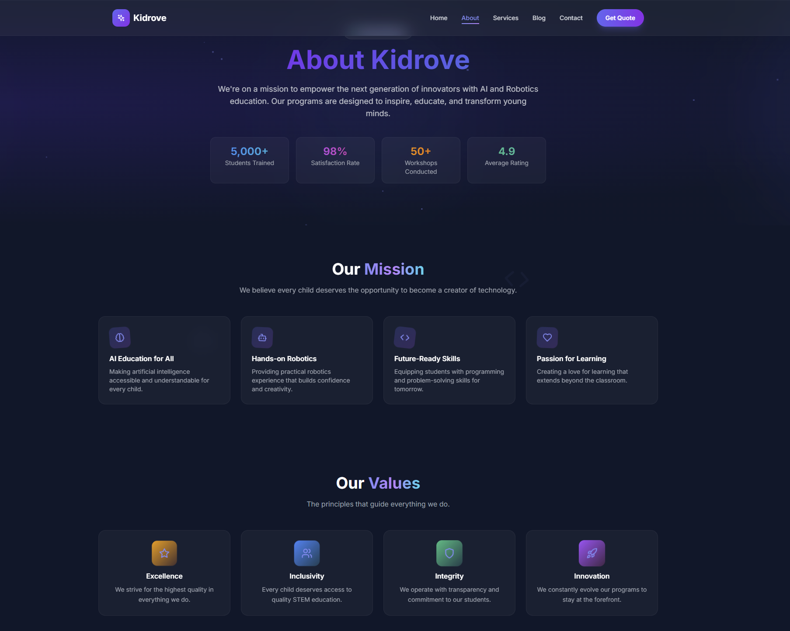
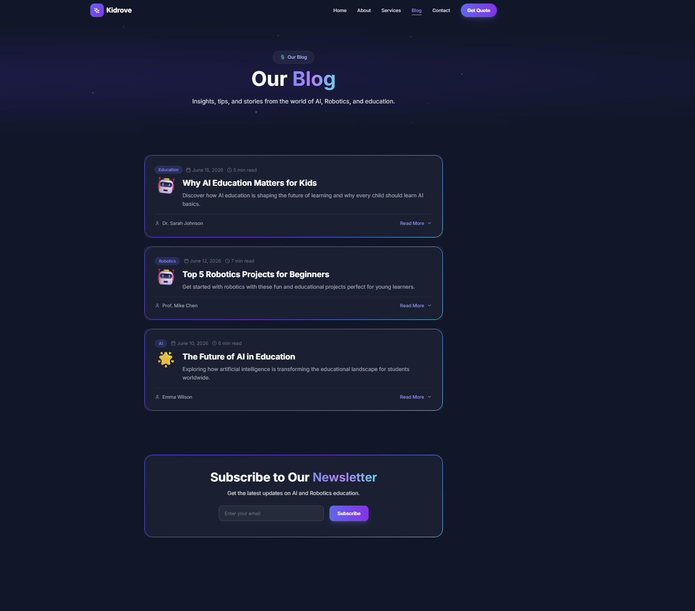
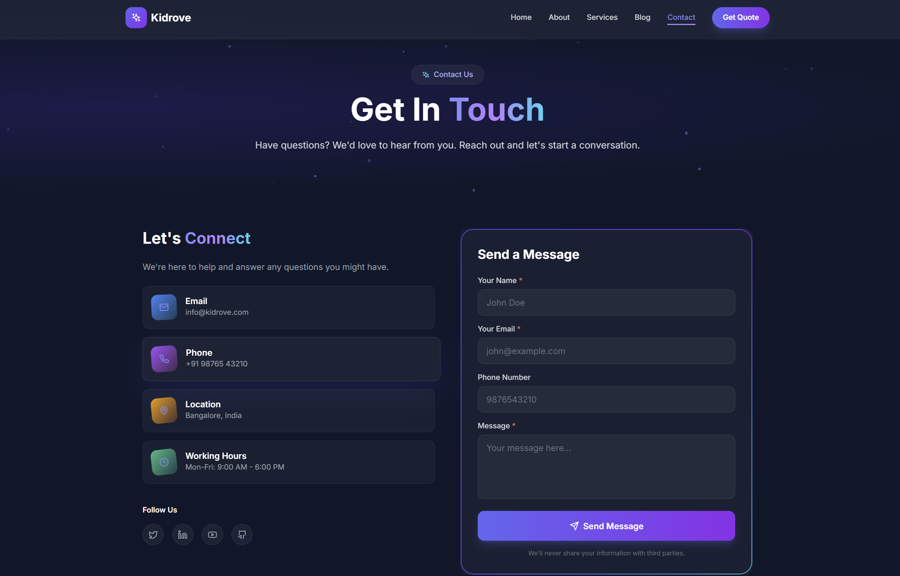

# AI & Robotics Summer Workshop 2026

<div align="center">
  
  
  
  
  
  
</div>

<br />

<p align="center">
  A premium, modern, full-stack workshop landing page for the <strong>AI & Robotics Summer Workshop</strong> built with React.js, Express.js, and MongoDB.
</p>

## 📋 Table of Contents

- [✨ Features](#-features)
- [🎨 Design](#-design)
- [🛠️ Tech Stack](#️-tech-stack)
- [📁 Project Structure](#-project-structure)
- [🚀 Installation](#-installation)
- [💻 Usage](#-usage)
- [📱 Responsive Design](#-responsive-design)
- [🔧 API Endpoints](#-api-endpoints)
- [🗄️ Database](#️-database)
- [🌟 Bonus Features](#-bonus-features)
- [📄 License](#-license)
- [👥 Contributors](#-contributors)

---

## ✨ Features

### 🎯 Frontend
-  **Premium SaaS-style UI** with glassmorphism effects
-  **Fully responsive** design for mobile, tablet, and desktop
-  **Smooth animations** using Framer Motion
-  **Interactive components** with hover effects and micro-interactions
-  **Multi-page routing** with React Router
-  **Form validation** with React Hook Form
-  **Loading states** and success notifications
-  **Floating particles** and animated backgrounds
-  **Professional navigation** with active page highlighting

### 🔧 Backend
-  **RESTful API** with Express.js
-  **MongoDB integration** with Mongoose
-  **Input validation** with Express Validator
-  **Error handling** middleware
-  **CORS enabled** for secure cross-origin requests
-  **Environment variables** configuration

### 📄 Pages
1. **Home** - Hero section with robot animation, workshop details, learning outcomes, FAQ, and registration form
2. **About** - Mission, values, team highlights, and journey timeline
3. **Services** - Detailed service cards with expandable information
4. **Blog** - Articles with "Read More" expandable content
5. **Contact** - Contact form with validation and backend integration

---

## 🎨 Design

### Color Palette
- **Primary**: `#4F46E5` (Indigo)
- **Secondary**: `#7C3AED` (Purple)
- **Accent**: `#06B6D4` (Cyan)
- **Background**: `#0F172A` (Dark)
- **Surface**: `rgba(255,255,255,0.08)`

### Design Elements
- 🪟 Glassmorphism effects with subtle blur backgrounds
- 🌈 Soft gradients using blue, purple, cyan, and indigo accents
- 🔲 Rounded corners (16px–24px)
- 🌑 Soft shadows and elevated cards
- 📱 Mobile-first responsive design
- ✨ Excellent spacing and visual hierarchy
- 🎯 Premium startup-quality appearance

---

## 🛠️ Tech Stack

### Frontend
| Technology | Version | Purpose |
|------------|---------|---------|
| React.js | 18.2.0 | Main UI framework |
| Tailwind CSS | 3.3.0 | Styling |
| Framer Motion | 10.16.4 | Animations |
| React Router DOM | 6.20.0 | Routing |
| React Hook Form | 7.48.2 | Form handling |
| Lucide React | 0.294.0 | Icons |
| Axios | 1.6.0 | HTTP client |
| Vite | 4.5.0 | Build tool |

### Backend
| Technology | Version | Purpose |
|------------|---------|---------|
| Node.js | 16+ | Runtime |
| Express.js | 4.18.2 | Server framework |
| MongoDB | 7.5.2 | Database |
| Mongoose | 7.5.2 | ODM |
| Express Validator | 7.0.1 | Input validation |
| Nodemon | 3.0.1 | Development server |
| Dotenv | 16.3.1 | Environment variables |
| Cors | 2.8.5 | CORS middleware |

---
## Screenshots

### Home Page


### About Page


### Services Page


### Blog Page


### Contact Page


### Hero Section


## Installation

### Prerequisites
- Node.js (v16 or higher)
- npm or yarn
- MongoDB (local or cloud)

### Step 1: Clone the Repository

```bash
git clone https://github.com/srii2109/AI-Robotics-Workshop.git
cd AI-Robotics-Workshop

cd backend
npm install

cd ../frontend
npm install

PORT=5000
MONGODB_URI=mongodb://localhost:27017/workshop

mongod

cd backend
npm run dev

cd frontend
npm run dev


